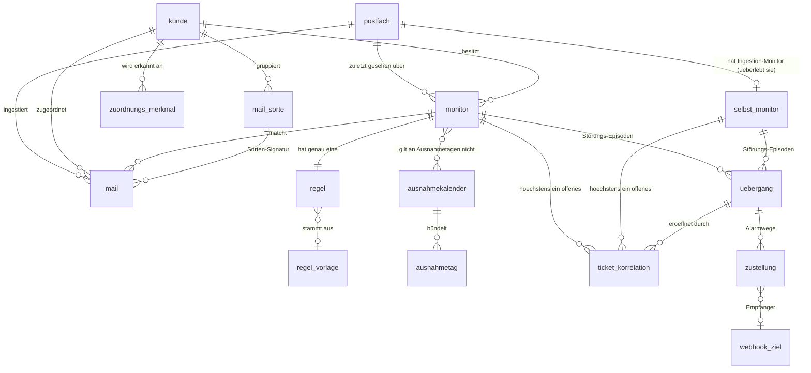

# Datenmodell

Umsetzung von [SPEC.md](../SPEC.md) §10. Verbindliche Begriffe: [CONTEXT.md](../CONTEXT.md) —
dieses Dokument erklärt die Domäne nicht neu, sondern hält fest, **wie** sie in Tabellen liegt
und **warum** dort, wo die Übersetzung nicht offensichtlich war.

Schema: `src/lib/server/db/schema/`, nach Domäne aufgeteilt und über `index.ts` gebündelt.
Migrationen: `drizzle/`, angewendet beim Start des `web`-Dienstes (SPEC §14).

## Konventionen

- Tabellen- und Spaltennamen sind snake_case und deutsch, Umlaute ausgeschrieben
  (`zaehler_obergrenze`, `uebergang`, `gestoert`). TypeScript-Schlüssel sind camelCase.
- Primärschlüssel sind `uuid` mit `gen_random_uuid()` als Default; Zeitpunkte durchweg
  `timestamptz`.
- Secrets liegen in `*_chiffre`-Spalten. Sie sind **noch nicht** verschlüsselt — SPEC §12
  verlangt AES-256-GCM at rest, das kommt mit #35. Der Name markiert die Absicht, damit die
  Härtung ohne Umbenennung auskommt.
- Enums heißen wie der Begriff in CONTEXT.md. Eine neue Monitor-Art kommt per
  `ALTER TYPE … ADD VALUE` — additiv und vorwärtskompatibel. Sie braucht allerdings **zwei**
  Migrationen: Postgres akzeptiert einen neuen Enum-Wert nicht in derselben Transaktion, in der
  er entsteht, und der CHECK `monitor_parameter_je_art` endet bewusst auf `else false` — eine
  unbekannte Art wird abgelehnt, statt ungeprüft durchzurutschen.

## Karte



Ohne Beziehung stehen `einstellungen` (Singleton-Zeile) und `heartbeat` (eine Zeile je Dienst).

## Die Entscheidungen, die man kennen muss

### `selbst_monitor` ist eine eigene Tabelle

Ein Selbst-Monitor erbt Zustandsmaschine und Alarm-Lebenszyklus vollständig, hat aber **keinen
Kunden, keine Regel und keine Monitor-Art**. Als `monitor`-Zeile müssten `kunde_id`, `art` und
die 1:1-Regel-Beziehung alle nullable werden — die Tabelle verlöre genau die Invarianten, die
sie tragen soll.

Folge für Folge-Sessions: `uebergang` verweist entweder auf `monitor` **oder** auf
`selbst_monitor`, abgesichert durch `uebergang_genau_ein_monitor`. Das deckt sich mit den
Korrelations-Keys aus SPEC §7 (`nw:{monitorId}:{uebergangId}` vs. `self:…`).

### Der Delta-Zustand eines Postfachs ist eine *Runde*, kein Token

Graph kodiert alle einmal gesetzten Query-Optionen (`$select`, `$filter`) in die Links, die es
zurückgibt — ein selbst zusammengebauter Aufruf aus einem extrahierten Token verlöre sie. Deshalb
wird der **vollständige Link** persistiert:

| Spalte | Bedeutung |
|---|---|
| `delta_token` | der `@odata.deltaLink` einer **abgeschlossenen** Runde |
| `delta_folge_link` | der `@odata.nextLink` einer **laufenden** Runde |

Beide `null` heißt „noch nie gepollt". Diese Trennung ist es, die einen 30-Tage-Backfill über
mehrere Ticks verteilbar und neustart-fest macht: der Poller holt pro Lauf nur ein Seiten-Budget
und hebt die Fortsetzung auf, statt ein volles Postfach in einem Rutsch zu ziehen.

`naechster_poll_fruehestens_am` ist zugleich Fälligkeit **und** Lease: der Claim schiebt sie im
selben Statement vor (`FOR UPDATE SKIP LOCKED`), womit zwei Worker dasselbe Postfach nicht
gleichzeitig pollen können — ohne Advisory-Lock und ohne Lease-Tabelle. `fehler_in_folge` trägt den
Exponenten der Backoff-Kurve; beides steht in der Zeile und nicht im Speicher, damit ein neu
gestarteter Worker nicht gegen ein throttelndes Graph läuft.

### `mail.aus_lernfenster` trennt Lernmaterial von Überwachungsmaterial

CONTEXT „Lernfenster": *Historie ist Lernmaterial, nicht Überwachungsmaterial.* Die Spalte wird
beim Insert aus `ankunftszeit < postfach.erstellt_am` berechnet — exakt, unabhängig davon wie lange
der Backfill läuft, und auch nach einem späteren `410`-Resync noch richtig. „Alles aus der ersten
Delta-Runde" wäre beides nicht.

### `uebergang` ist eine Episode, kein Zeitpunkt

Eine Zeile spannt von „gesund → gestört" bis zur Entwarnung. SPEC §10 hängt Vorkommens-Zähler
und Quittiert-Marker an dieselbe Entität wie `alert_id` und Alarmgrund — beides beschreibt die
Spanne. Daraus folgen zwei partielle Unique-Indizes:

```sql
CREATE UNIQUE INDEX uebergang_offen_je_monitor_key
  ON uebergang (monitor_id) WHERE beendet_am IS NULL;
```

Damit ist „ein Alarm pro Übergang" (SPEC §6) eine Datenbank-Garantie, keine Disziplin im
Anwendungscode. Wer eine zweite offene Episode anlegen will, hat einen Bug.

Die Schwester-Regel „**ein offenes Ticket pro Monitor**" ist eine *eigene* Garantie und sitzt auf
`ticket_korrelation`, nicht hier — denn ein Ticket überlebt seine Episode: Erledigen und
Auto-Zurück kommentieren nur, das Ticket bleibt offen, und ein Re-Alarm hängt sich daran. Erst
„Re-Alarm nach Schließung" macht ein neues auf. Deshalb hängt `ticket_korrelation` am **Monitor**
und nicht 1:1 an der Episode; `uebergang_id` ist nur die Herkunft.

Zeitachse einer Episode:

| Spalte | Bedeutung |
|---|---|
| `begonnen_am` | Übergang nach `gestoert`, der Alarm geht sofort raus |
| `verschaerft_am` | Wechsel des Grunds **zu** „fehler_gemeldet" — der einzige automatische Zwischen-Kommentar |
| `letztes_vorkommen_am`, `vorkommen` | intern gezählt, Zusammenfassung geht mit der Entwarnung raus; trägt Auto-Zurück |
| `beendet_am` | interne Erholung — Dashboard flippt sofort |
| `entwarnt_am` | Entwarnung nach außen, erst nachdem die Entwarnungs-Stabilität hielt |
| `erholungs_art` | nur `beweis` darf ein Ticket automatisch schließen |

### Monitor-Parameter sind Spalten, keine JSON-Blobs

Es sind rund zehn Felder, und der Zeit-Scheduler muss über sie filtern. Der Dreiklang-Vertrag
steht als CHECK in der Datenbank: `monitor_parameter_je_art` verlangt je Art ihre eigenen
Zeitparameter und **verbietet** die der anderen Arten, sodass ein umgestellter Monitor kein
verwaistes Fenster mitschleppt. `monitor_erwartung_vollstaendig` erzwingt, dass eine Erwartung
genau die Nutzlast ihres Modus trägt — Intervall oder Kalenderplan, nie beides.
`monitor_alarmgrund_zum_zustand` koppelt Grund und Zustand: `gestoert` trägt immer einen
Alarmgrund, `gesund` nie — ein Grund kann die Erholung also nicht überleben.

**Kein `anlauf`-Feld.** CONTEXT definiert Anlauf als „ein volles Fenster T seit Aktivierung bzw.
seit Ende eines Ausnahmetags" — berechenbar aus `aktiviert_am`, `zaehler_fenster_sekunden` und
den `ausnahmetag`-Zeilen. Eine materialisierte Spalte wäre redundanter Zustand, der driftet.

`aktiviert_am` ist zugleich die Grenze „ab hier vorwärts": vor diesem Zeitpunkt darf nie
alarmiert werden (CONTEXT „Lernfenster" — Historie ist Lernmaterial, kein Überwachungsmaterial).

**Aber ein `soll_geprueft_bis_am`.** Der Zeit-Scheduler (#26) merkt sich je Monitor, bis wohin er
die Soll-Zeitpunkte des Kalenderplans beurteilt hat. Das ist — anders als der Anlauf — *kein*
materialisierter Ableitungswert, sondern ein Fortschritts-Merker über gefällte Entscheidungen:
`zuletzt_gesehen_am` kennt nur die letzte Mail, also lässt sich nach einem Stillstand aus keiner
anderen Spalte mehr sagen, ob das Soll von vorgestern abgedeckt war. Ohne ihn würde ein verpasstes
Soll still vergeben. Er wandert nur vorwärts (`greatest`), damit ein Soll nie zweimal zählt.

### Die Ingestion sagt zu, bis wohin sie vollständig ist

`postfach.ingestion_stand_am` behauptet: **jede** Mail dieses Postfachs mit
`ankunftszeit <= ingestion_stand_am` liegt als Zeile vor. Der Zeit-Scheduler urteilt nie darüber
hinaus — sonst gälte ein Heartbeat um 06:00 als überfällig, während der 05:58-Report noch bei Graph
liegt, und der Fehlalarm wäre nicht mehr einzufangen.

Die Zusage rückt nur vor, wo sie belegbar ist: wenn eine Delta-Runde **abgeschlossen** ist (Graph
liefert `@odata.deltaLink`), und dann auf den **Beginn** dieser Runde minus einer Sicherheitsspanne
für Graphs eventually consistent Delta-Index — nicht auf ihr Ende, denn eine zehn Minuten pagende
Runde weiß über diese zehn Minuten nichts. Dafür merkt sich `runde_begonnen_am` den Rundenbeginn.
Ein Fehlschlag rückt nichts vor; ein gestörtes Postfach setzt die Zeit-Auswertung damit von selbst
aus — CONTEXT „Ingestion-Gate", aus den Daten abgeleitet statt aus einer Zustandsmaschine.

### Zwei Muster-Slots, vier Lesarten

`regel.muster_schlecht` und `regel.muster_gut` sind bewusst generisch benannt. Jede Monitor-Art
liest sie anders: Heartbeat Fehler/OK · Ereignis —/Harmlos-Filter · Paar Auf/Zu · Zähler gar
nicht. Eine Struktur, ein Ort für den Klassifikator-Steckplatz. Alle Muster-Felder sind Arrays,
weil Regeln sprachunabhängig sind.

### Kollisionen sind erlaubt, Duplikate nicht

`zuordnungs_merkmal` hat einen **nicht**-eindeutigen Index auf `(stufe, wert)`. Dasselbe Merkmal
bei zwei Kunden muss speicherbar bleiben (CONTEXT „Kollisionswarnung", Übergangsphasen) — es
wird gewarnt, nicht verboten, und zeigt sich zur Laufzeit als „mehrdeutig". Verboten ist nur
dasselbe Merkmal zweimal am **selben** Kunden.

### `einstellungen` ist eine Zeile

`id smallint PRIMARY KEY DEFAULT 1` plus `CHECK (id = 1)`. Keine zweite Konfiguration möglich,
kein `ORDER BY … LIMIT 1`-Ritual in Queries.

### `webhook_ziel` steht neben `einstellungen`

SPEC §10 führt die Webhook-Ziele unter „einstellungen", aber §7 verlangt ein **Secret pro Ziel**
und §12 dessen Verschlüsselung als eigener Wert. Als jsonb-Array wäre kein Secret eine eigene
Zeile — die Härtung in #35 und der Fremdschlüssel aus `zustellung` bräuchten sie aber.

## Indizes und ihre Konsumenten

| Index | Wofür |
|---|---|
| `mail (postfach_id, ankunftszeit)` | Bereichs-Scans je Postfach, Aufräumen je Postfach |
| `mail (postfach_id, graph_message_id)` unique | idempotentes Delta-Polling |
| `mail (monitor_id, ankunftszeit)` | Heartbeat „zuletzt gesehen", Zähler-Fenster, Monitor-Drawer |
| `mail (ankunftszeit)` | globaler Retention-Sweep (#34) |
| `mail (triage_grund)` partiell | die Triage-Liste als kleine Scheibe einer großen Tabelle |
| `mail_sorte (kunde_id, signatur)` unique | Sorten-Signatur, wirkt pro Kunde — nie global |
| `zuordnungs_merkmal (stufe, wert)` | der Lookup-Pfad der Kunden-Zuordnung |
| `mail (kunde_id, ankunftszeit)` | Mails eines Kunden, und die Lösch-Kaskade |
| `uebergang (monitor_id) WHERE beendet_am IS NULL` unique | eine offene Episode pro Monitor |
| `ticket_korrelation (monitor_id) WHERE zustand = 'offen'` unique | ein offenes Ticket pro Monitor |
| `selbst_monitor (art) WHERE art = 'kern'` unique | genau ein „Nightwatch-Kern" |

## Löschen und Aufbewahren (SPEC §11)

Kaskaden bilden ab, was SPEC als „Löschen auf Zuruf" beschreibt — und **nur** das:

- Postfach löschen → seine Mails und der Delta-State verschwinden. Sein Selbst-Monitor bleibt
  als *stillgelegter* Monitor ohne Postfach-Bezug stehen, damit Alarm-Historie und
  Ticket-Korrelationen erhalten bleiben. Ohne diese Bremse hätte die Kette
  `postfach → selbst_monitor → uebergang → ticket_korrelation` ein noch offenes PSA-Ticket
  verwaisen lassen: Nightwatch hielte den Korrelations-Key nicht mehr und könnte es nie wieder
  kommentieren oder schließen.
- Kunde löschen → seine Mails, Monitore, Regeln, Merkmale, Sorten **und Historie** — hier nennt
  SPEC §11 die Historie ausdrücklich mit.
- Monitor löschen → seine Regel und seine Übergangs-Historie verschwinden.
- Webhook-Ziel löschen → wird **verweigert**, solange Zustellungen daran hängen; dieser Beleg ist
  die Grundlage der Dead-Letter-Anzeige. Zum Abschalten gibt es `aktiv`.

Fremdschlüssel auf `mail` sind indiziert (`kunde_id`, `sorte_id`, `zuordnungs_merkmal_id`):
Postgres indiziert die verweisende Seite nicht von selbst, und ohne diese Indizes würde jedes
Kunden-Löschen die größte Tabelle sequenziell scannen.

Dauerhaft bleiben soll dagegen alles, was **keine** Mail-Bodies trägt. Deshalb liegen Statistik
(`mail_sorte`) und Historie (`uebergang`, `ticket_korrelation`) in eigenen Tabellen und werden
nicht aus Mails nachgerechnet — der Retention-Löschjob (#34) darf `mail` leeren, ohne dass die
Instanz ihr Gedächtnis verliert.

## Seeds

`drizzle/0002_seed.sql` legt zwei Zeilen an, die die Anwendung nie selbst erzeugen darf:

- den globalen Selbst-Monitor `kern` („Nightwatch-Kern"): nicht anlegbar, nicht löschbar, nicht
  pausierbar — und Voraussetzung der Wurzel-Unterdrückung (SPEC §8);
- die Einstellungs-Zeile `id = 1`.

Beide mit `ON CONFLICT DO NOTHING`, weil Migrate-on-Startup idempotent sein muss.
Die **Postfach**-Selbst-Monitore entstehen dagegen zusammen mit ihrem Postfach im
Anwendungscode, nicht als Seed.

## Ändern des Schemas

```sh
bun run db:generate    # nach jeder Schema-Änderung: erzeugt die Migration
bun run db:check       # prüft die Migrationen auf Kollisionen
bun run db:migrate     # wendet sie an (DATABASE_URL nötig)
```

CI erzwingt, dass generierte Migrationen mitcommittet sind, und führt die Invarianten-Tests
(`src/lib/server/db/schema.test.ts`) gegen ein echtes Postgres aus. Diese Tests laufen lokal nur
mit gesetztem `DATABASE_URL` und werden sonst übersprungen.
